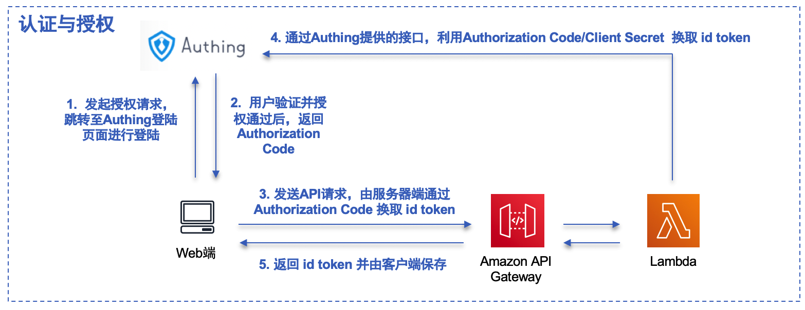
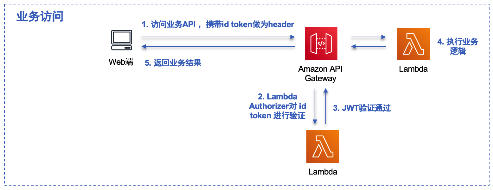
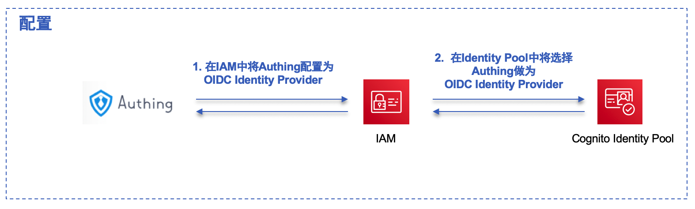
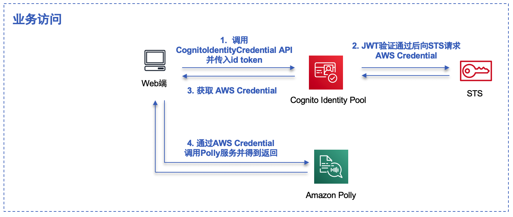
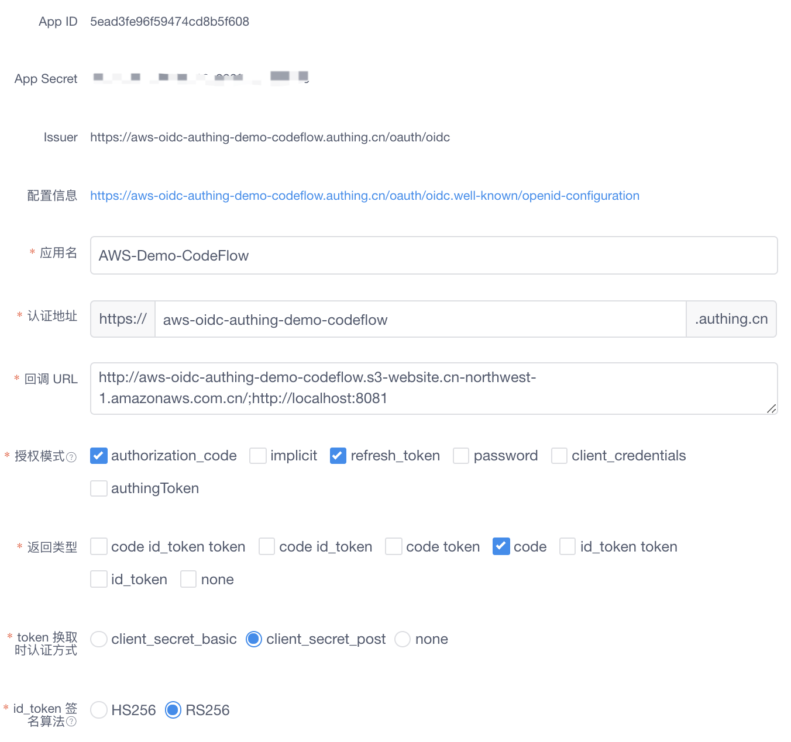
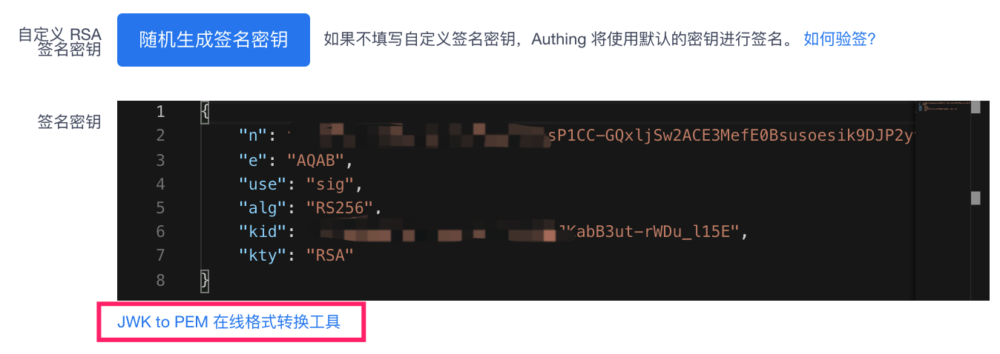

# AWS集成Authing认证服务的演示

这是一个简单的示例，演示如何在AWS国内区域集成Authing.cn的认证服务，用来做为AWS Cognito User Pool的替代方案。

## 基本介绍

AWS Cognito User Pool是AWS做为身份池的托管服务，在许多AWS Solutions或是用户创建的WEB/移动端应用都被广泛的使用。通过该服务可以快速建立一个身份池并与AWS的其他服务集成，并用来做身份认证和授权。一个常用的场景是API Gateway可以集成Cognito User Pool进行用户身份认证与授权，方便对API进行保护。另一个常用的场景是结合Cognito Identity Pool来在Web或移动端安全地获取AWS临时密钥，进而访问其他AWS服务。

目前Cognito User Pool服务在国内区域暂时未上线，这对将国外的AWS Solutions或用户应用迁移至国内区域部署造成困难。这个项目会演示如何通过集成第三方的认证服务(Authing.cn)，来替代Cognito User Pool的功能，并实现上述提到的两个常用的业务场景。

寻找Cognito User Pool的替代方案的基本思路，是找到一个基于 OpenID Connect 协议的认证服务，可以是第三方SaaS(如Authing, Auth0等)，或是自建(如基于开源的 Keycloark 软件)。Authing是AWS在国内的合作伙伴，因此在这个项目会演示如何使用Authing来做为Cognito User Pool的替代方案，可以访问下面演示网站查看实现效果：

http://aws-oidc-authing-demo-codeflow.s3-website.cn-northwest-1.amazonaws.com.cn/

## 实现

### 通过OIDC Authorization Code Flow获取id token的实现：



注：使用Authorization Code Flow以便支持非https网站，对于https网站可以使用Implicit Flow以简化获取id token的流程，相关实现会在后续进行补充

### 通过id token对API Gateway进行访问




### 将Authing添加为OIDC Identity Provider




注：相关AWS操作配置后续进行补充


### 通过Cognito Identity Pool获取AWS临时密钥




## 部署

需要先在Authing中创建OIDC应用，具体可以参考这篇[文章](https://juejin.im/post/5cc66c71e51d456e2e656de0)。这个演示环境使用的是OIDC Authocation Code Flow，并使用RS256算法进行id token签名，可参考如下进行回调URL、授权模式、返回类型等设置：




并在高级选项中生成签名密钥，根据控制台上的链接进行JWK和PEM的转换，然后将生成的公钥保存在 lambda-authorizer/authing_pubkey.pem 文件中：




演示环境中API Gateway及相关Lambda已经描述在SAM模板(template.yaml)中，修改模板相应参数后，通过SAM可以直接进行自动部署：

```bash
$ sam build
$ sam deploy --guided
```

前端演示页面可以上传到S3桶，并开启静态网站功能，或是部署在一台EC2上（演示网站的地址需要在SAM模板中进行更新）


## 示例

目前基本这个方案已经将两个AWS Solutions进行改造并迁移至国内区域，具体可参考：

- [AWS Connected Vehicle Solution](https://github.com/linjungz/aws-connected-vehicle-solution)
- [AWS IoT Device Simulator](https://github.com/linjungz/iot-device-simulator-cn)